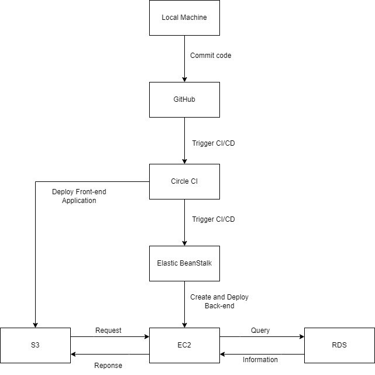

# Pipeline Process

## Steps

- Create AWS S3 bucket.
- Create AWS RDS database.
- Test run application locally.
- Configuring CircleCI config file `config.yml` is used to define the pipeline process. It is used to run the tests, and deploy the application to AWS Elastic Beanstalk.
- Create a new repository on Github. Connect the CircleCI project to Github repository.
- Configure environment variables in CircleCI settings.
- Push the code to Github. CircleCI will automatically run the tests and deploy the application to AWS Elastic Beanstalk.
- Check CI pipeline status in CircleCI dashboard. Check log for any errors or warnings.
- The application is now deployed to AWS Elastic Beanstalk. Check again in AWS Elastic Beanstalk to see the deployed application.

## Diagram

